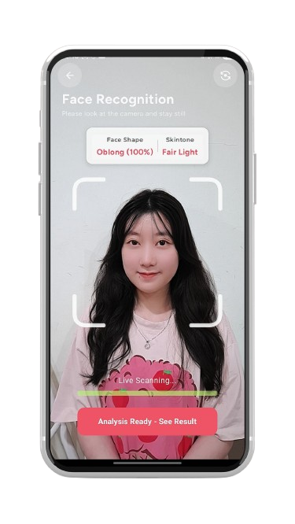
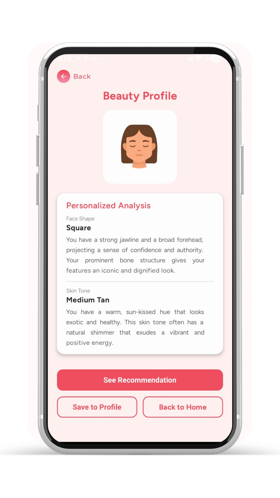
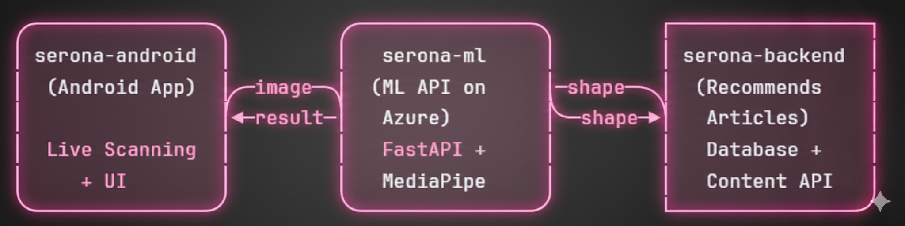

# 🧠 Serona ML - Face Shape Classification

> Machine learning pipeline for **Serona**, an Android app that recommends personalized makeup styles and placements based on face shape and skin tone.

[](https://github.com/aryakasyahrezki/serona-ml/actions/workflows/ml_pipeline.yml)


---

## 📖 What is Serona?

**Serona** is a mobile Android app that helps users discover makeup styles suited to their face. Users open the app and the camera begins **live scanning in real-time**, the model continuously analyzes the face and updates the prediction automatically. Once the user click the see result button, it shows the face shape and skin tone analysis, then recommends personalized makeup tutorial articles.

1. **Live face shape scanning** — continuous real-time detection using this ML model (Heart, Oblong, Oval, Round, Square)
2. **Skin tone detection** — color analysis on certain face regions (Fair Light, Medium Tan, Deep)
3. **Personalized recommendations** — step-by-step WikiHow-style makeup tutorial articles tailored to the user's face shape and skin tone

[Download on Google Playstore]([https://github.com/aryakasyahrezki/serona-android](https://play.google.com/store/apps/details?id=com.serona.app&pcampaignid=web_share))

---

## 📱 App Screenshots

| Live Scanning | Result |
|:---:|:---:|
|  |  |
| Camera continuously scans and updates | Face shape + skin tone + recommendations |

> **Live Scanning:** Unlike a one-time capture, Serona continuously processes each camera frame in real-time. The result updates automatically — users simply look at the camera and the prediction stabilizes within seconds, creating a smooth, real-time experience.

---

## 🌐 Live API

```
https://serona-ml.wittysmoke-32718122.southeastasia.azurecontainerapps.io/
```

| Endpoint | Method | Description |
|----------|--------|-------------|
| `/` | GET | Health check |
| `/predict` | POST | Predict face shape + skin tone from image |

---

## ⚙️ Installation

### Prerequisites

- Python **3.11**
- pip
- Virtual environment (recommended)

### Steps

```bash
# 1. Clone the repository
git clone https://github.com/aryakasyahrezki/serona-ml.git
cd serona-ml

# 2. Create and activate virtual environment
python -m venv .venv

# Windows
.venv\Scripts\activate

# Mac/Linux
source .venv/bin/activate

# 3. Install all dependencies
pip install -r requirements.txt
```

---

## 📦 Dependencies & Libraries

| Library | Version | Purpose |
|---------|---------|---------|
| `fastapi` | 0.128.0 | REST API framework |
| `uvicorn` | 0.40.0 | ASGI server |
| `gunicorn` | 21.2.0 | Production WSGI server |
| `python-multipart` | 0.0.21 | File upload handling |
| `mediapipe` | 0.10.14 | Face landmark detection |
| `opencv-python-headless` | 4.8.1.78 | Image processing |
| `scikit-learn` | 1.3.2 | ML pipeline (LogReg, RFECV, etc.) |
| `numpy` | 1.26.4 | Numerical operations |
| `pandas` | 2.1.4 | DataFrame for model input |
| `scipy` | 1.11.4 | Statistical functions |
| `joblib` | 1.5.2 | Model serialization (.pkl) |
| `pydantic` | 2.12.5 | Request/response validation |

Install all at once:
```bash
pip install -r requirements.txt
```

---

## ▶️ How to Run

### Option 1: Run API locally

```bash
cd machine_learning_final/scripts
python api.py
# API available at http://localhost:8000
# Interactive docs at http://localhost:8000/docs
```

### Option 2: Run with Docker

```bash
# Build image
docker build -t serona-ml .

# Run container
docker run -p 8000:8000 serona-ml
# API available at http://localhost:8000
```

### Option 3: Run local webcam test (live scanning)

```bash
cd machine_learning_final/tests
python test_live_scan.py
# Opens webcam — face the camera and hold still
# Model continuously scans and updates result in real-time
# Press Q to quit
```

### Test the API

```bash
# Health check
curl http://localhost:8000/

# Predict from image
curl -X POST http://localhost:8000/predict \
  -F "file=@your_face_image.jpg"
```

---

## 📁 Project Structure

```
serona-ml/
│
├── .github/
│   └── workflows/
│       └── ml_pipeline.yml         # CI/CD — GitHub Actions (7 jobs)
│
├── assets/                         # Screenshots for README
│   ├── ss_camera.png
│   └── ss_result.png
│
├── machine_learning_final/
│   ├── data/
│   │   ├── processed_data/
│   │   |   └── data_30s_cropped.csv  # 150 processed face samples
|   |   └── raw_data_30s_cropped/
│   │       ├── Heart                 # 30 cropped (face only) heart shaped faces
│   │       ├── Oblong                # 30 cropped (face only) oblong shaped faces
│   │       ├── Oval                  # 30 cropped (face only) oval shaped faces
│   │       ├── Round                 # 30 cropped (face only) round shaped faces
│   │       └── Square                # 30 cropped (face only) square shaped faces
│   │
│   ├── models/
│   │   └── model.pkl               # Trained model artifact
│   │
│   ├── notebooks/
│   │   └── model.ipynb             # Full ML pipeline notebook
│   │
│   ├── scripts/
│   │   ├── api.py                  # FastAPI application
│   │   ├── process_raw_data.py     # Feature extraction from raw images
│   │   └── register_model.py       # Model versioning using W&B
│   │
│   └── tests/
|       ├── test_api_health.py      # Quick API sanity check
│       ├── test_api_latency.py     # Full latency benchmark (P50/P90/P95)
│       ├── test_live_scan.py       # Local webcam live scanning test
│       ├── test_memory_usage.py    # RAM usage profiling
│       ├── test_model_size.py      # Model artifact size analysis
│       ├── test_robustness.py      # Robustness under image perturbations
│       └── unit_tests.py           # Pytest unit tests (24 tests)
│
├── Dockerfile
└── requirements.txt
```

---

## 🤖 Model

### Overview

| Property | Value |
|----------|-------|
| **Algorithm** | Logistic Regression |
| **Feature Engineering** | Polynomial Features (degree=2) |
| **Feature Selection** | RFECV (Recursive Feature Elimination with CV) |
| **CV Strategy** | Stratified K-Fold (k=5) |
| **Input Features** | 8 geometric facial ratios |
| **Selected Features** | 10 (from 44 polynomial features) |
| **Classes** | Heart, Oblong, Oval, Round, Square |
| **Training Samples** | 150 (30 per class) |
| **CV F1-Macro** | 74.21% ± 7.53% |
| **Random Seed** | 4 |

### Input Features

Features extracted from facial landmarks detected by **MediaPipe Face Mesh**:

| Feature | Description |
|---------|-------------|
| `ratio_len_width` | Face length / face width |
| `ratio_jaw_cheek` | Jaw width / cheek width |
| `ratio_forehead_jaw` | Forehead width / jaw width |
| `avg_jaw_angle` | Average jaw angle (degrees) |
| `ratio_chin_jaw` | Chin width / jaw width |
| `circularity` | Face oval circularity score |
| `solidity` | Convex hull solidity |
| `extent` | Bounding box coverage ratio |

### Pipeline Architecture

```
Raw Image
    │
    ▼
MediaPipe Face Mesh          (landmark detection)
    │
    ▼
Feature Extraction           (8 geometric features)
    │
    ▼
PolynomialFeatures(degree=2) (8 → 44 features)
    │
    ▼
StandardScaler               (normalize features)
    │
    ▼
RFECV                        (44 → 10 selected features)
    │
    ▼
LogisticRegression           (predict class)
    │
    ▼
Face Shape + Confidence
```

### Model Selection Process

| Stage | What Was Tested |
|-------|----------------|
| **Baseline (11 models)** | Logistic Regression, SVC, KNN, Naive Bayes, Decision Tree, Random Forest, Extra Trees, AdaBoost, Gradient Boosting, XGBoost, LightGBM |
| **Hyperparameter Tuning** | GridSearchCV on best candidates (LogReg, SVC) |
| **Advanced Strategies** | RFECV vs Stacking — RFECV selected |
| **Stability Analysis** | 50 random seeds tested, seed 47 selected |

> **No data leakage** — all preprocessing (scaling, polynomial features) happens inside the sklearn Pipeline, within each CV fold.

---

## ⚙️ CI/CD

This repo uses **GitHub Actions** for automated testing on every push and pull request to `main`.

### Pipeline (8 jobs)

```
push / pull_request to main
│
├── 1. Lint             — flake8 on api.py, process_raw_data.py, unit_tests.py
├── 2. Unit Tests       — pytest (24 tests) with coverage report
├── 3. Model Validation — loads model, checks accuracy ≥ 65%, validates inference
├── 4. API Validation   — syntax check, required functions present
├── 5. Latency Check    — benchmarks P50/P95 latency
├── 6. Model Size Check — verifies model.pkl < 50MB
├── 7. CI Summary       — fails if any job above fails
└── 8. Deploy to Azure  — model versioning and auto deployment to azure
```

👉 [View pipeline runs](https://github.com/aryakasyahrezki/serona-ml/actions)

---

## 🐳 Docker

```bash
# Build
docker build -t serona-ml .

# Run
docker run -p 8000:8000 serona-ml
```

---

## 📡 API Reference

### `GET /`

```json
{
  "status": "online",
  "service": "Serona AI",
  "location": "Cloud"
}
```

### `POST /predict`

**Request:** `multipart/form-data` with `file` field (image)

**Response (success):**
```json
{
  "status": "success",
  "shape": "Oval (87%)",
  "skintone": "Medium Tan",
  "server_inference_ms": "1.52",
  "total_request_ms": "8.34",
  "breakdown": {
    "file_read_ms": 1.21,
    "decode_ms": 1.18,
    "mediapipe_ms": 4.83,
    "feature_extraction_ms": 0.09,
    "ml_inference_ms": 1.52,
    "skintone_ms": 0.31
  }
}
```

**Response (no face):**
```json
{ "status": "failed", "message": "No face detected" }
```

---

## 🔗 Related Repositories

Serona is a full-stack system across 3 repositories:

| Repository | Description | Link |
|------------|-------------|------|
| **serona-ml** | ML model, FastAPI, testing, CI/CD ← *you are here* | [serona-ml](https://github.com/aryakasyahrezki/serona-ml) | 
| **serona-backend** | Backend server, database, business logic, article content | [serona-backend](https://github.com/aryakasyahrezki/serona-backend) |
| **serona-android** | Android mobile app (Kotlin), UI, camera integration | [serona-android](https://github.com/aryakasyahrezki/serona-android) |

### System Architecture

| System Architecture Illustration |
|:---:|
|  |

---

## 👥 Team

**Group 5 — DINAS Group**

| Name | Student ID |
|------|-----------|
| Aryaka Syahrezki | 2802540244 |
| Dea Audreyla Hadi | 2802540074 |
| I Gusti Ngurah Radithya Bagus Santosa | 2802538675 |
| Iyurichie Lay | 2802539980 |
| Shinta Aulia | 2802538731 |

---

## 📄 License

This project is for academic purposes — Bina Nusantara University.
