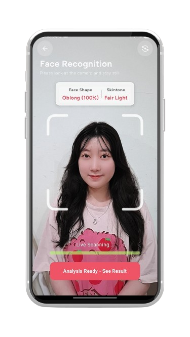
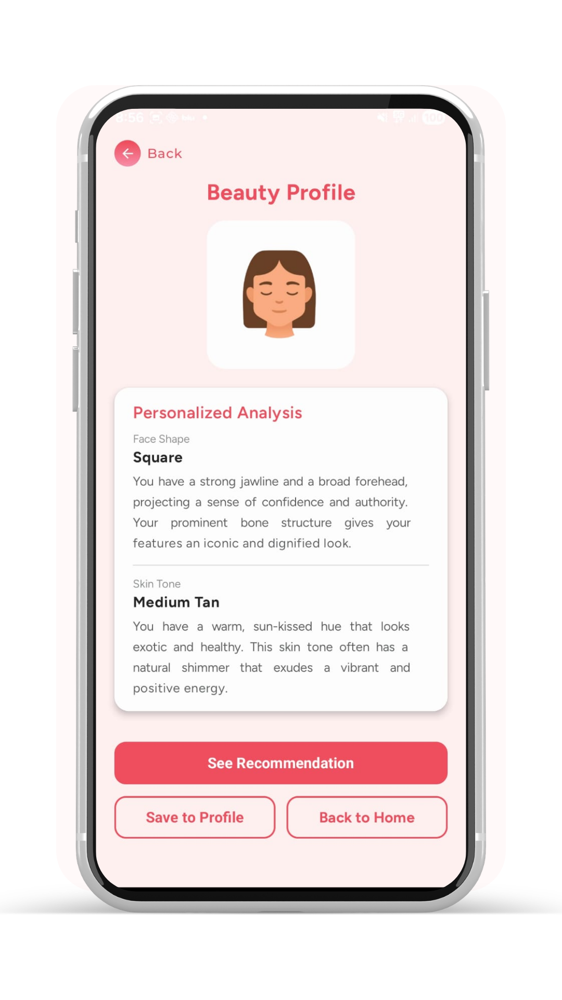

# 🧠 Serona ML - Face Shape Classification API

> Machine learning service for **Serona**, an AI-powered personal makeup assistant that provides face shape classification and skin tone analysis.

[](https://github.com/aryakasyahrezki/serona-ml/actions/workflows/ml_pipeline.yml)


**Built with:** Python 3.11 • FastAPI • scikit-learn • MediaPipe • Docker

---

## 📖 What is Serona?

**Serona** is an Android app that helps users discover makeup styles suited to their unique features through **live real-time face scanning**.

**Key Features:**
1. **Live face shape detection** — Heart, Oblong, Oval, Round, Square
2. **Skin tone analysis** — Fair Light, Medium Tan, Deep
3. **Personalized recommendations** — Makeup tutorials tailored to face shape and skin tone

🔗 [Download on Google Play Store](https://play.google.com/store/apps/details?id=com.serona.app&pcampaignid=web_share)

---

## 📱 App Screenshots

| Live Scanning | Result |
|:---:|:---:|
|  |  |
| Camera continuously scans and updates | Face shape + skin tone + recommendations |

> **Live Scanning:** Unlike a one-time capture, Serona continuously processes each camera frame in real-time. The result updates automatically — users simply look at the camera and the prediction stabilizes within seconds, creating a smooth, real-time experience.

---

## ⚡ Quick Start (This Service Only)

### Prerequisites
- Docker installed
- Port 8000 available

### Run with Docker
```bash
# Clone repository
git clone https://github.com/aryakasyahrezki/serona-ml.git
cd serona-ml

# Build Docker image
docker build -t serona-ml .

# Run container
docker run -d -p 8000:8000 --name serona-ml-api serona-ml

# Verify it's running
curl http://localhost:8000/
# Expected: {"status":"online","service":"Serona AI",...}
```

### Stop Service
```bash
docker stop serona-ml-api
docker rm serona-ml-api
```

---

## 💻 System Requirements

### For Running Complete System Locally

**Minimum Specifications:**
- **CPU:** Intel i5 (4 cores) or AMD Ryzen 5 equivalent
- **RAM:** 8 GB
- **Storage:** 10 GB free space
- **OS:** Windows 10/11, macOS 10.15+, or Ubuntu 20.04+
- **Docker:** 20.10 or later
- **Android Studio:** Otter (2025.2.1) or newer

**Recommended Specifications:**
- **CPU:** Intel i7 (6+ cores) or AMD Ryzen 7 equivalent
- **RAM:** 16 GB (for smooth emulator performance)
- **Storage:** 20 GB free space (SSD preferred)
- **OS:** Windows 11, macOS 12+, or Ubuntu 22.04+
- **Docker:** 24.0 or later
- **Android Studio:** Otter (2025.2.1) or newer

**Additional Requirements:**
- **Internet connection** for initial setup (downloading images, dependencies)
- **USB port** if using physical Android device
- **Webcam** for face scanning (if using emulator)

**Note:** These requirements are for running the **complete system** (ML API + Backend + Android app) simultaneously. If you only need to run individual services, requirements are lower.

---

## 🔗 Running Complete Serona System

> **Note:** To use the app, you need all services running (ML + Backend + Android). Follow the steps below to set up the complete system.

### System Architecture
```
Android App (serona-android)
    ├─→ ML API (serona-ml) :8000
    │   └─→ Returns face shape + skin tone
    │
    └─→ Backend API (serona-backend) :8080
        └─→ Stores user data + provides articles
```

**Note:** ML API and Backend API are independent services. The Android app communicates with both separately.

---

### Prerequisites
- Docker & Docker Compose
- Android Studio (Otter 2025.2.1+)
- Git

---

### Step 1: Start ML Service
```bash
# Clone ML repository
git clone https://github.com/aryakasyahrezki/serona-ml.git
cd serona-ml

# Build and run
docker build -t serona-ml .
docker run -d -p 8000:8000 --name serona-ml-api serona-ml

# Verify
curl http://localhost:8000/
# Expected: {"status":"online",...}
```

---

### Step 2: Start Backend Service
```bash
# Navigate to parent directory
cd ..

# Clone backend repository
git clone https://github.com/aryakasyahrezki/serona-backend.git
cd serona-backend

# Copy environment file
copy .env.example .env

# Build and run (Laravel + MySQL)
docker compose up -d --build

# Wait ~30 seconds for migrations to complete

# Verify
curl http://localhost:8080/
# Expected: Laravel response
```

---

### Step 3: Run Android App
```bash
# Navigate to parent directory
cd ..

# Clone Android repository
git clone https://github.com/aryakasyahrezki/serona-android.git
cd serona-android

# Open in Android Studio
# File → Open → Select serona-android folder that contains app folder
```

---

### Step 4: Setup Port Forwarding

**Android devices cannot access `localhost` directly. Run the connection script every time you reconnect your physical phone, restart your device or laptop, or once your emulator has fully finished booting up:**

**Windows:**

Double-click the file:
```bash
connect_to_docker.bat
```

**Mac/Linux:**
1. Open your Terminal in this folder.
2. Give the script permission to run (only needs to be done once):
   ```bash
   chmod +x connect_to_docker.sh
   ```
3. Run the scripts
    ```bash
    ./connect_to_docker.sh
    ```

This forwards device ports to your computer:
- Port 8080 (Backend) → `http://127.0.0.1:8080`
- Port 8000 (ML API) → `http://127.0.0.1:8000`

---

### Step 5: Firebase Configuration

This app requires **Firebase Authentication** (Login & Register).  
You can use the existing credentials provided in the repo, or set up your own Firebase project by following these steps:


#### **1. Create a Project in Firebase Console**

- Open the Firebase Console  
- Click **Add Project**  
- Enter your project name (e.g., `Serona-App`)  
- Click **Create Project**


#### **2. Register the Android App**

- In the Firebase Dashboard, click the **Android icon** to add a new app.
- Fill in the following:
    - **Android Package Name**  
      Open `build.gradle.kts` (Module `:app`) and find the `namespace` or `applicationId`.  
      It must match exactly (`com.serona.app`).

    - **App Nickname** (Optional)  
       Example: `Serona Mobile`

- Click **Register App**.


#### **3. Install `google-services.json`**

- Download the `google-services.json` file from Firebase.
- In Android Studio, change the folder view from **Android → Project**.
- Navigate to the `app/` folder.
- **Delete** the old `google-services.json`.
- **Paste** your new file inside the `app/` folder.

> Note: You can skip the **"Add Firebase SDK"** step in the console — it is already configured in this project.


#### **4. Enable Authentication Services**

- Go to **Build → Authentication → Get Started**.
- Open the **Sign-in method** tab.
- Enable **Email/Password**.


#### **5. Connect to Backend (Service Account)**

- Go to **Project Settings (⚙️) → Service Accounts**.
- Click **Generate New Private Key**.  
  A `.json` file will be downloaded.

Then:

- Open your `serona-backend` folder.
- Navigate to:

```
storage/app/
```

- Delete the old `firebase-admin.json`.
- Paste your new key file.
- Rename it exactly to:

```
firebase-admin.json
```

- Make sure your backend `.env` file points to this file correctly.


#### **6. Refresh the Backend Containers**

Warning: This will reset your local database.

```bash
# Stop and remove all existing data
docker compose down -v

# Rebuild and restart services
docker compose up -d --build

# Clear Laravel cache
docker compose exec app php artisan config:clear
docker compose exec app php artisan cache:clear
```


#### **7. Sync Android Studio**

- Click **Sync Project with Gradle Files**
- Go to **Build → Clean Project**
- Then **Build → Rebuild Project/Assemble Project**
  
---

### Step 6: Configure Camera (Emulator Only)

If using Android Emulator for face scanning:

1. **Device Manager** → Edit AVD
2. **Show Advanced Settings**
3. **Camera** → Front Camera → Webcam0
4. **Finish**

---

### Step 7: Run App

1. **Select Build Variant:** View → Build Variants → Set `:app` to `debug`
2. **Run:** Click Run (▶️) or press Shift+F10
3. **Test:**
   - Register new account
   - Login
   - Open camera for face scan
   - View results and recommendations

---

### Verification Checklist

After starting all services:

- [ ] ML API running: http://localhost:8000
- [ ] Backend running: http://localhost:8080
- [ ] Port forwarding active: Run `adb reverse --list`
- [ ] Android app opens without crashes
- [ ] Face scan works and returns predictions

### Service Ports

| Service | Port | Desktop URL | Android Emulator URL |
|---------|------|-------------|---------------------|
| ML API | 8000 | http://localhost:8000 | http://127.0.0.1:8000 |
| Backend | 8080 | http://localhost:8080 | http://127.0.0.1:8080 |
| Database | 3306 | localhost:3306 | - |

---

## 📁 Project Structure
```
serona-ml/
│
├── .github/
│   └── workflows/
│       └── ml_pipeline.yml         # CI/CD — GitHub Actions (8 jobs)
│
├── assets/                         # Screenshots for README
│   ├── ss_camera.png
│   └── ss_result.png
│
├── machine_learning_final/
│   ├── data/
│   │   ├── processed_data/
│   │   |   └── data_30s_cropped.csv  # 150 processed face samples
|   |   └── raw_data_30s_cropped/
│   │       ├── Heart                 # 30 cropped (face only) heart shaped faces
│   │       ├── Oblong                # 30 cropped (face only) oblong shaped faces
│   │       ├── Oval                  # 30 cropped (face only) oval shaped faces
│   │       ├── Round                 # 30 cropped (face only) round shaped faces
│   │       └── Square                # 30 cropped (face only) square shaped faces
│   │
│   ├── models/
│   │   └── model.pkl               # Trained model artifact
│   │
│   ├── notebooks/
│   │   └── model.ipynb             # Full ML pipeline notebook
│   │
│   ├── scripts/
│   │   ├── api.py                  # FastAPI application
│   │   ├── process_raw_data.py     # Feature extraction from raw images
│   │   └── register_model.py       # Model versioning using W&B
│   │
│   └── tests/
|       ├── test_api_health.py      # Quick API sanity check
│       ├── test_api_latency.py     # Full latency benchmark (P50/P90/P95)
│       ├── test_live_scan.py       # Local webcam live scanning test
│       ├── test_memory_usage.py    # RAM usage profiling
│       ├── test_model_size.py      # Model artifact size analysis
│       ├── test_robustness.py      # Robustness under image perturbations
│       └── unit_tests.py           # Pytest unit tests (24 tests)
│
├── Dockerfile
└── requirements.txt
```

---

## 📡 API Reference

### Health Check
```bash
GET /

Response:
{
  "status": "online",
  "service": "Serona AI",
  "location": "Cloud"
}
```

### Face Prediction
```bash
POST /predict
Content-Type: multipart/form-data

Parameters:
- file: image file (jpg, png)

Success Response:
{
  "status": "success",
  "shape": "Oval (87%)",
  "skintone": "Medium Tan",
  "server_inference_ms": "1.52",
  "total_request_ms": "8.34"
}

Failure Response:
{
  "status": "failed",
  "message": "No face detected"
}
```

---

## 🤖 Model Details

| Property | Value |
|----------|-------|
| **Algorithm** | Logistic Regression |
| **Feature Engineering** | Polynomial Features (degree=2) |
| **Feature Selection** | RFECV |
| **Input Features** | 8 geometric ratios |
| **Selected Features** | 10 (from 44 polynomial) |
| **Classes** | Heart, Oblong, Oval, Round, Square |
| **CV F1-Macro** | 74.21% ± 7.53% |
| **Random Seed** | 4 |

### Input Features

| Feature | Description |
|---------|-------------|
| `ratio_len_width` | Face length / width |
| `ratio_jaw_cheek` | Jaw width / cheek width |
| `ratio_forehead_jaw` | Forehead width / jaw width |
| `avg_jaw_angle` | Average jaw angle (degrees) |
| `ratio_chin_jaw` | Chin width / jaw width |
| `circularity` | Face oval circularity |
| `solidity` | Convex hull solidity |
| `extent` | Bounding box coverage |

---

## 🔗 Related Repositories

| Repository | Description | Link |
|------------|-------------|------|
| **serona-ml** | ML API for face analysis ← *You are here* | [serona-ml](https://github.com/aryakasyahrezki/serona-ml) |
| **serona-backend** | Backend API & database | [serona-backend](https://github.com/aryakasyahrezki/serona-backend) |
| **serona-android** | Android mobile app | [serona-android](https://github.com/aryakasyahrezki/serona-android) |

---

## 👥 Team

**Group 5 — DINAS**

| Name | Student ID |
|------|-----------|
| Aryaka Syahrezki | 2802540244 |
| Dea Audreyla Hadi | 2802540074 |
| I Gusti Ngurah Radithya Bagus Santosa | 2802538675 |
| Iyurichie Lay | 2802539980 |
| Shinta Aulia | 2802538731 |

---

## 📄 License

This project is for academic purposes — Bina Nusantara University.
